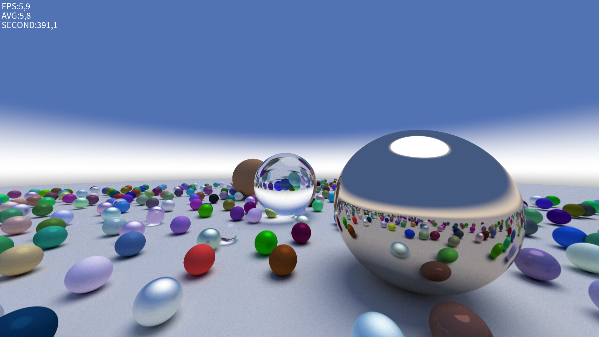
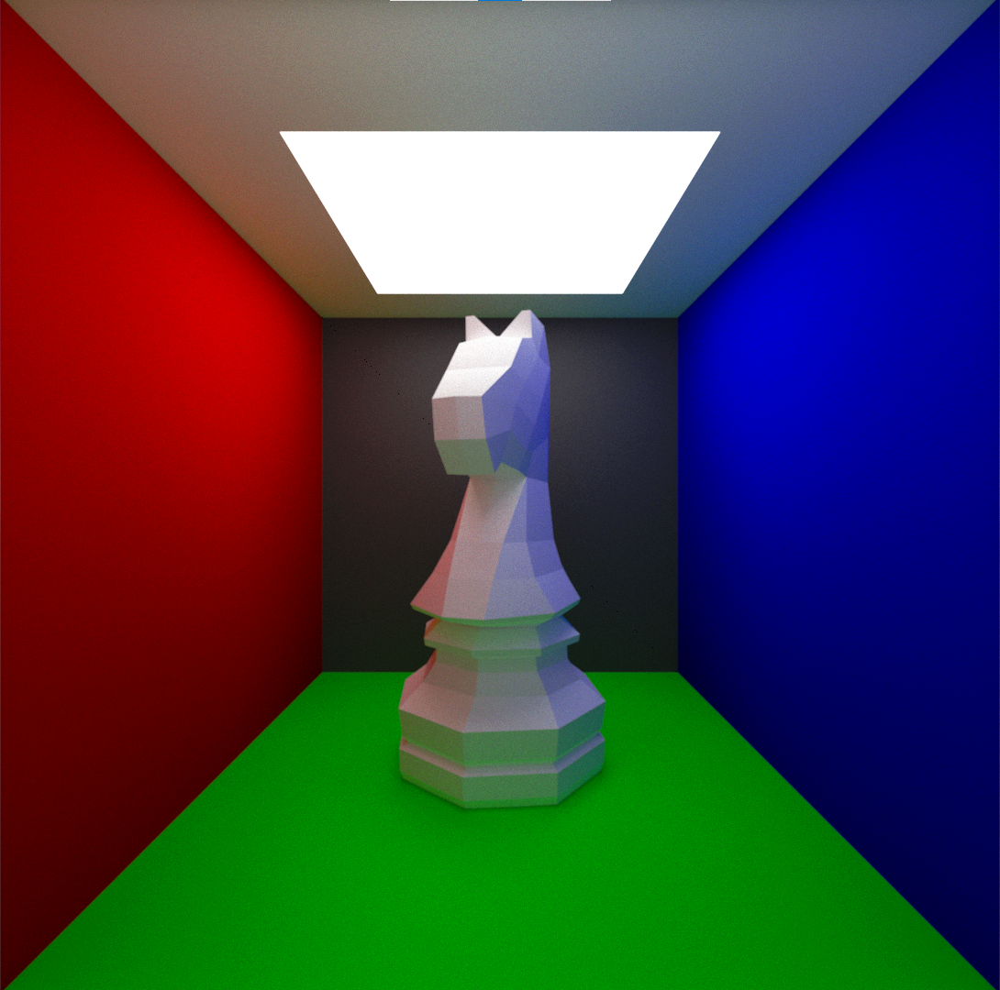
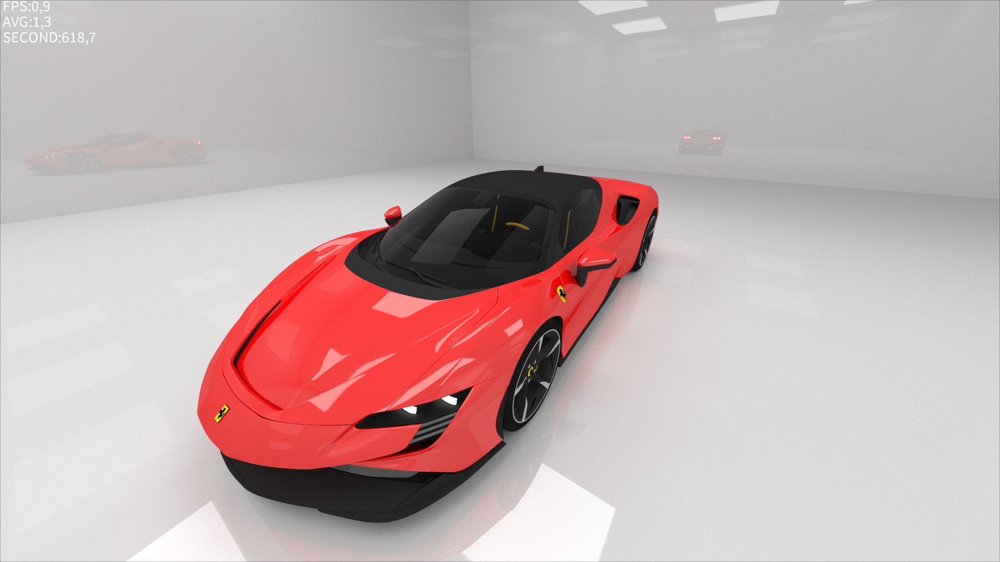

# Ray-Tracing
Demo photos of the rtx engine:

484 randomly appeared balls and 3 fixed material giant balls standing on a big white ball as a ground.

A room that is shaped like a cube that has six walls. Each of these six walls is a different color and also has the property of a mirror, reflecting everything inside the room. In the very center of this room, there is only one ball, and this ball itself is also a mirror, reflecting the colorful, mirrored walls around it.

A 3D rendered cupe-shaped room. The left wall is red, the right wall is blue, the back wall is black, and the floor is green. The ceiling is white with a rectangular light fixture. In the center of the room stands a large, white, geometric representation of a chess knight.

A Ferrari inside a well-lit garage with white walls.

Demo video.
[Demo](https://youtu.be/UlJwjacHxpQ)
