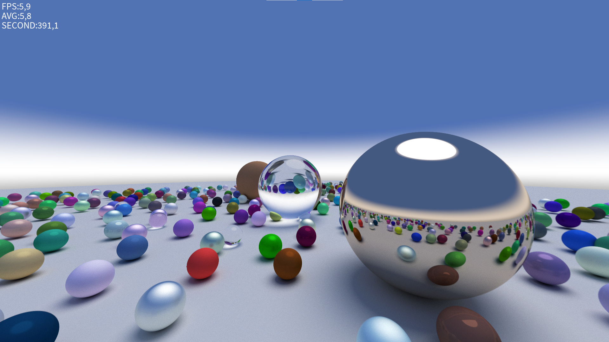
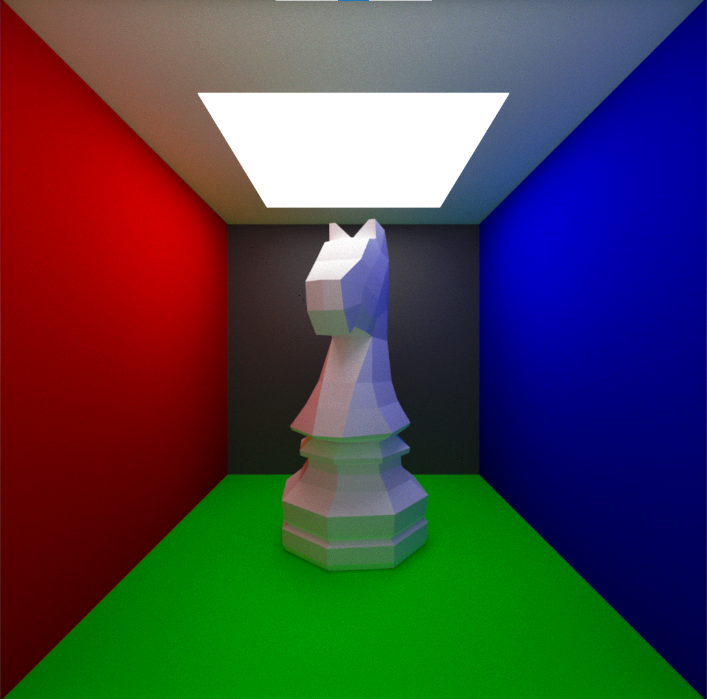
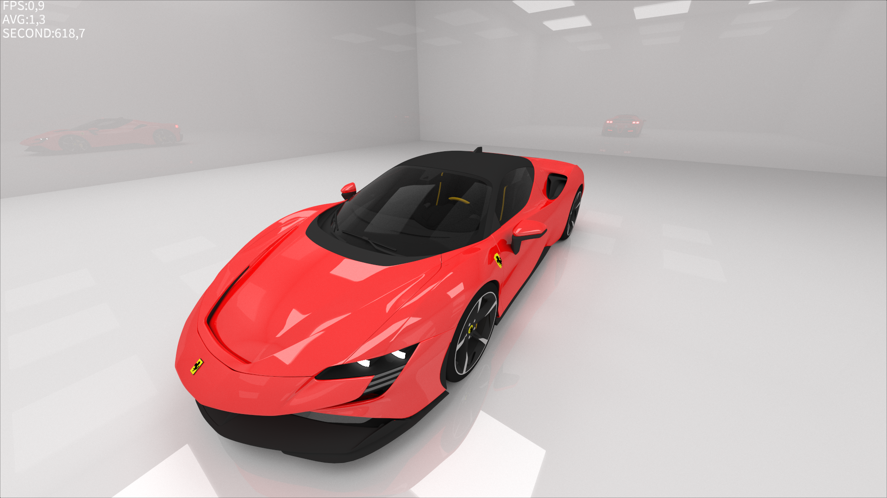

# Ray-Tracing

A high-performance real-time ray tracing engine built with Processing and OpenGL compute shaders. This project implements a physically-based path tracer capable of rendering complex 3D scenes with realistic lighting, reflections, refractions, and global illumination.

## 🌟 Features

- **Real-time Ray Tracing**: GPU-accelerated path tracing using OpenGL 4.x compute shaders
- **Physically-Based Rendering**: 
  - Diffuse, specular, and dielectric materials
  - Realistic reflections and refractions
  - Global illumination with ambient light
  - Light emitting materials
- **Advanced Acceleration Structures**: Bounding Volume Hierarchy (BVH) for efficient ray-shape intersection
- **HDR Environment Mapping**: Support for high dynamic range environment maps
- **Progressive Rendering**: Accumulation buffer for noise reduction over time
- **3D Model Support**: OBJ file loading with MTL material support
- **Interactive Camera**: First-person camera controls with mouse and keyboard
- **Customizable Materials**: Full control over material properties (smoothness, specularity, dielectric index)
- **Video Export**: Frame-by-frame rendering for video creation

## 🖼️ Demo Gallery

### 484 Randomly Generated Spheres
A scene with 484 randomly positioned spheres with various materials and 3 large spheres on a reflective ground plane.


### Infinite Mirror Room
A cube-shaped room with six colored walls, each with mirror properties. A single reflective sphere in the center creates infinite recursive reflections.


### Chess Knight in Cornell Box
A classic Cornell box setup (colored walls: red, blue, green) with a white chess knight model and area light ceiling.


### Ferrari in Garage
A detailed Ferrari 3D model rendered in a well-lit white garage environment.


### Video Demo
[Watch the full demo video on YouTube](https://youtu.be/zVmh3xrQWFE)

## 🛠️ Technical Architecture

### Core Components

1. **RayTracing.pde**: Main application entry point
   - Scene setup and management
   - Render loop and frame updates
   - User input handling
   - Compute shader orchestration

2. **Camera.pde**: First-person camera system
   - Position and orientation management
   - Ray generation for each pixel
   - View frustum calculations

3. **Scene.pde**: Scene graph management
   - BVH tree construction and optimization
   - Shape and material data serialization
   - GPU buffer management

4. **Shader.pde**: OpenGL compute shader integration
   - Shader compilation and linking
   - Buffer object management (SSBOs)
   - Uniform variable updates

5. **Shape.pde**: Geometric primitives
   - Triangle mesh representation
   - Bounding box calculations
   - Normal interpolation

6. **BVHNode.pde**: Acceleration structure
   - Spatial subdivision (BVH tree)
   - SAH (Surface Area Heuristic) optimization
   - Recursive tree splitting

7. **Material.pde**: Material system
   - Diffuse, specular, and emission properties
   - Dielectric materials (glass, water)
   - Color and roughness controls

### Shader Pipeline

The rendering pipeline uses OpenGL compute shaders for GPU-accelerated ray tracing:

- **structs.glsl**: Data structure definitions (Ray, Material, Shape, BVHNode)
- **funcs.glsl**: Utility functions (random number generation, vector operations)
- **camera.glsl**: Camera ray generation
- **shape.glsl**: Ray-geometry intersection tests
- **ray.glsl**: Ray propagation and bouncing logic
- **rayTracer.glsl**: Main path tracing algorithm
- **shader.glsl**: Fragment shader for final display

## 📋 Prerequisites

- **Processing 3.x or 4.x**: Download from [processing.org](https://processing.org/)
- **Java 8 or higher**: Required by Processing
- **OpenGL 4.3+**: GPU with compute shader support
- **Python 3.x** (optional): For video generation from frames
  - `opencv-python` library for video encoding

## 🚀 Installation

1. **Clone the repository**:
   ```bash
   git clone https://github.com/omselkara/Ray-Tracing.git
   cd Ray-Tracing
   ```

2. **Open in Processing**:
   - Launch Processing IDE
   - Open `RayTracing.pde` from the repository folder

3. **Verify OpenGL Support**:
   - The application requires OpenGL 4.3+ with compute shader support
   - Check your GPU drivers are up to date

4. **Run the project**:
   - Click the "Run" button in Processing (or press `Ctrl+R`)
   - The application will load the scene and begin rendering

## 🎮 Controls

### Keyboard Controls
- **W**: Move camera forward
- **S**: Move camera backward
- **A**: Move camera left
- **D**: Move camera right
- **Q**: Move camera up
- **E**: Move camera down
- **Space**: Reset accumulation buffer (refresh render)
- **R**: Toggle statistics display (FPS, average FPS)

### Mouse Controls
- **Mouse Drag**: Rotate camera view (first-person look)
- **Mouse Wheel**: Adjust field of view (zoom in/out)

## 📂 Project Structure

```
Ray-Tracing/
├── RayTracing.pde          # Main application file
├── Camera.pde              # Camera system
├── Scene.pde               # Scene management
├── Shape.pde               # Geometry primitives
├── BVHNode.pde             # Acceleration structure
├── Material.pde            # Material definitions
├── Shader.pde              # Shader integration
├── Vector.pde              # Vector math utilities
├── Ray.pde                 # Ray data structure
├── Rectangle.pde           # Rectangle primitive
├── Line.pde                # Line primitive
├── Color.pde               # Color utilities
├── HDR.pde                 # HDR image loading
├── video.py                # Video generation script
├── models/                 # 3D model files (.obj, .mtl)
├── shaders/                # GLSL compute shaders
│   ├── structs.glsl
│   ├── funcs.glsl
│   ├── camera.glsl
│   ├── shape.glsl
│   ├── ray.glsl
│   ├── rayTracer.glsl
│   └── shader.glsl
└── *.png                   # Demo render outputs
```

## ⚙️ Configuration

### Render Settings

In `RayTracing.pde`, you can adjust these parameters in the `setup()` function:

```java
// Ray tracing quality settings
reflectCount = 10;        // Maximum ray bounces (higher = more realistic, slower)
rayCount = 1;             // Rays per pixel per frame (1 for progressive rendering)
blurStrength = 2.0;       // Motion blur strength
showAmbientLight = 1;     // Enable/disable ambient lighting

// Window resolution
size(1280, 720, P2D);     // Windowed mode
// fullScreen(P3D);        // Fullscreen mode (uncomment to use)
```

### Camera Settings

In `Camera.pde` global variables:

```java
float povDst = 1.0;       // Distance to image plane
float horizontalPov = 4;  // Horizontal field of view
float verticalPov = 4;    // Vertical field of view
float speed = 10f;        // Camera movement speed
```

### Scene Configuration

In `RayTracing.pde` `setupScene()` function:

- **Load 3D Models**: Uncomment `addModel()` calls to load OBJ files
- **Add Primitives**: Use `addRectangle()` to create walls, floors, ceilings
- **Configure Materials**: Set material properties (color, smoothness, specularity)
- **BVH Depth**: Adjust `scene.splitNodes(32)` parameter for tree depth

### Material Properties

```java
Material mat = new Material();
mat.col = rgb(255, 0, 0);           // Diffuse color (red)
mat.smoothness = 1;                  // Surface smoothness (0-1)
mat.specularChance = 0.995;          // Reflectivity (0-1)
mat.specularColor = rgb(255);        // Reflection tint
mat.dielectric = 2;                  // Refractive index (1=air, 1.5=glass)
mat.isLight = 3;                     // Light emission strength
mat.lightCol = rgb(255, 255, 200);   // Emission color
```

## 🎬 Video Export

To create a video from rendered frames:

1. **Enable frame saving** in `RayTracing.pde`:
   ```java
   // In draw() function, change 'false' to 'true'
   if ((millis()-time)/1000.0 >= deltaFrameTime && true) {
       saveFrame("images/frame"+imageIndex+".png");
       // ...
   }
   ```

2. **Configure video parameters**:
   ```java
   float deltaFrameTime = 40;      // Seconds per frame
   float totalVideoTime = 21600;   // Total video duration in seconds
   ```

3. **Run the rendering**: The application will save frames to `images/` folder

4. **Generate video** using Python script:
   ```bash
   python video.py
   ```
   This creates `output_video.mp4` at 60 FPS from the rendered frames.

## 🎨 Creating Custom Scenes

### Adding a Simple Cornell Box

```java
void setupScene() {
  List<Shape> shapes = new ArrayList<>();
  
  // Create materials
  Material red = new Material();
  red.col = rgb(255, 0, 0);
  red.smoothness = 1;
  
  Material white = new Material();
  white.col = rgb(255);
  white.smoothness = 1;
  
  Material light = new Material();
  light.isLight = 3;
  light.lightCol = rgb(255);
  
  // Add walls
  addRectangle(new Vector(-5, -5, 5), new Vector(-5, -5, -5), 
               new Vector(-5, 5, -5), new Vector(-5, 5, 5), 
               red, shapes);  // Left wall (red)
  
  addRectangle(new Vector(-5, -5, 5), new Vector(5, -5, 5), 
               new Vector(5, -5, -5), new Vector(-5, -5, -5), 
               white, shapes);  // Floor
  
  // Add ceiling light
  addRectangle(new Vector(-2, 4.9, -2), new Vector(-2, 4.9, 2), 
               new Vector(2, 4.9, 2), new Vector(2, 4.9, -2), 
               light, shapes);
  
  // Build BVH and add to scene
  BVHNode node = new BVHNode(shapes);
  scene.nodes.add(node);
  scene.splitNodes(16);
}
```

### Loading 3D Models

```java
Material mat = new Material();
mat.smoothness = 1;
mat.col = rgb(255);

addModel("models/yourmodel.obj",      // Path to OBJ file
         new Vector(0, -5, 0),         // Position
         new Vector(1, 1, 1),          // Scale
         new Vector(0, PI/2, 0),       // Rotation (X, Y, Z)
         mat,                          // Material
         shapes,                       // Shape list
         false);                       // Smooth normals
```

## 🚀 Performance Tips

1. **BVH Depth**: Higher values (32+) improve intersection speed but increase build time
2. **Ray Bounces**: Lower `reflectCount` for faster rendering (5-10 is usually sufficient)
3. **Resolution**: Lower resolution for real-time interaction, higher for final renders
4. **Progressive Rendering**: Let the image accumulate over time for better quality
5. **Model Complexity**: Use simplified models for faster loading and rendering
6. **HDR Background**: Disable HDR maps if not needed for faster rendering

## 🔧 Troubleshooting

### Black Screen / No Rendering
- Check GPU supports OpenGL 4.3+
- Update graphics drivers
- Verify compute shader compilation (check console for errors)

### Low FPS
- Reduce `reflectCount` parameter
- Lower window resolution
- Simplify scene geometry
- Reduce BVH tree depth

### Model Not Loading
- Check file path is correct (relative to sketch folder)
- Ensure OBJ file uses triangles (not quads)
- Verify MTL file is in same directory as OBJ

### Shader Compilation Errors
- Check `shaders/` folder contains all GLSL files
- Verify shader syntax (OpenGL 4.3 GLSL)
- Check console output for specific error messages

## 📚 Technical Details

### Ray Tracing Algorithm

This implementation uses Monte Carlo path tracing with importance sampling:

1. **Ray Generation**: Camera generates primary rays for each pixel
2. **Intersection**: BVH acceleration structure finds closest hit
3. **Material Evaluation**: BRDF calculates surface response
4. **Light Sampling**: Direct light sampling for faster convergence
5. **Recursive Bouncing**: Rays bounce multiple times for global illumination
6. **Accumulation**: Progressive refinement reduces noise over time

### BVH Construction

The Bounding Volume Hierarchy uses:
- **SAH (Surface Area Heuristic)** for optimal split plane selection
- **Recursive subdivision** to configurable depth
- **AABB (Axis-Aligned Bounding Box)** nodes for fast intersection tests
- **Leaf node packing** for cache-friendly memory layout

### Material Model

Supports multiple BRDFs:
- **Lambertian diffuse** for matte surfaces
- **Microfacet specular** (GGX/Cook-Torrance) for metals
- **Fresnel dielectric** for glass and transparent materials
- **Emissive** for area lights

## 📄 License

This project is open source and available for educational and personal use.

## 👏 Credits

Created by omselkara

Special thanks to:
- Processing Foundation for the Processing framework
- OpenGL for compute shader support
- The computer graphics research community for ray tracing techniques

## 🤝 Contributing

Contributions are welcome! Feel free to:
- Report bugs and issues
- Suggest new features
- Submit pull requests
- Improve documentation

## 📞 Contact

For questions, suggestions, or collaboration:
- GitHub: [@omselkara](https://github.com/omselkara)
- Project Link: [https://github.com/omselkara/Ray-Tracing](https://github.com/omselkara/Ray-Tracing)

---

**Happy Ray Tracing! 🌈✨**
